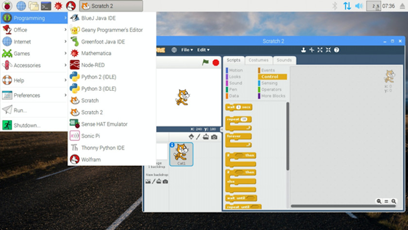
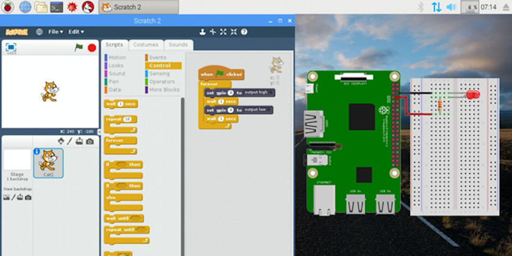
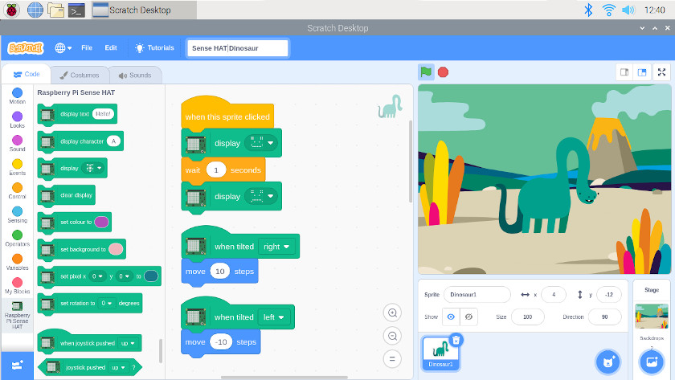
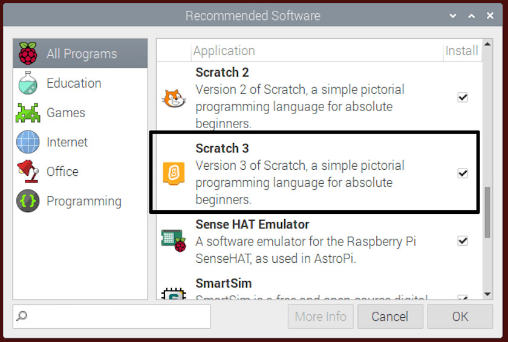
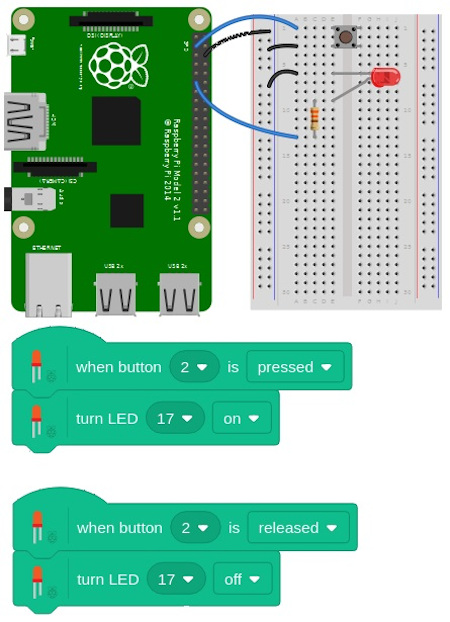

## Aprender a programar con Scratch en Raspberry Pi

Como se explica en nuestros <a target="_blank" href="https://www.programoergosum.com/cursos-online/scratch">tutoriales de programación</a>, Scratch es un lenguaje de programación por bloques distinado a la enseñanza de la programación desde edades tempranas. La aplicación de los lenguajes de programación por bloques permiten una presentación visual del paradigma y metodología de la programación informática permitiendo centrarse en la lógica de la programación dejando a un lado la sintaxis propia de los lenguajes de programación (puntos y comas, paréntesis, etc)



<br />


## Scratch 2.0 en Raspbian SO

La versión 2.0 lleva algunos años disponible aunque Raspbian seguía incluyendo la versión anterior 1.4 hasta la llegada de la versión 3.0 de Scratch. El problema es que la versión 2.0 utilizaba Flash con la intención de ejecutarse en un navegador, lo que dejaba fuera a la Raspberry Pi al no tener un intérprete de Flash. Raspbian incorpora un plugin de Flash para que sea posible ejecutar Flash en el navegador aunque la versión disponible de Scratch no tiene conexión a internet y se ejecuta en modo offline.

La mayor ventaja de programar con Scratch en Raspberry Pi es la posibilidad de utilizar los pines GPIO y conectar el mundo digital con el mundo físico a través de salidas y entradas digitales.



> Accede a nuestro <a target="_blank" href="https://www.programoergosum.com/cursos-online/raspberry-pi/242-control-de-gpio-con-scratch-en-raspberry-pi/introduccion">tutorial</a> donde aprenderás a programar con Scratch utilizando los pines GPIO de tu raspberry Pi.


<br />


## Scratch 3.0 en Raspbian SO

Scratch 3 ha lanzado su versión de escritorio para Raspbian en Raspberry Pi y este puede ser el empujón que te falta para empezar a programar.

Entre las mejoras de Scratch 3.0 sobre sus anteriores versiones hay que destacar el salto de Flash a HTML5, haciéndolo compatible con muchos dispositivos más. También encontramos una renovación de la interfaz con bloques mayores y más fáciles de leer, y trasladando el resultado del programa a la parte derecha de la pantalla. Además, disponemos de nuevos editores de sonido y sprites y nuevos bloques para integrar.



Para instalar esta versión de Scratch solo tenemos que actualizar los repositorios de Raspbian e instalar el paquete de Scratch. Todo lo podemos hacer con la siguiente línea en la terminal:

### Instalación en Raspbian

Para instalar esta versión de Scratch solo tenemos que actualizar los repositorios de Raspbian e instalar el paquete de Scratch. Para ello podemos acceder a través de programas recomendados de Raspbian para instalarlo.



O por otro lado, podemos instalarlo mediante la siguiente instrucción en la línea de comandos.

```sh
pi@raspberrypi: ~ $ sudo apt update
pi@raspberrypi: ~ $ sudo apt install scratch3
```

Una vez instalado ya podemos empezar a programar con Scratch 3.0 sobre Raspberry Pi y utilizar los pines GPIO para conectar el mundo digital con el mundo físico.


