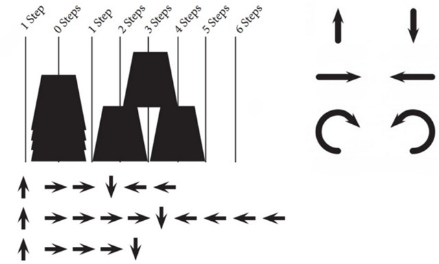

## CS Unplugged

Actualmente podemos encontrar numerosas actividades para desarrollar el pensamiento computacional desde educación infantil sin la necesidad de utilizar un ordenador. Estas actividades son ideales para ir adquiriendo ciertas destrezas en el mundo de la programación informática.

<a target="_blank" href="https://csunplugged.org/es/">CS Unplugged</a> es una colección de material didáctico y de libre acceso que enseña las bases de la informática a través de interesantes juegos y puzles con la ayuda de cartas, cuerdas, lápices y mucha actividad física.

Todas las actividades del libro están planteadas de forma sencilla. En cada una de ellas se plantean un conjunto de instrucciones sobre cómo plantearlos, además de por supuesto unos objetivos y edades mínimas recomendadas. El objetivo principal del proyecto es promocionar la informática entre los niños, niñas y jóvenes.

> Accede a la CS Unplugged para <a target="_blank" href="https://classic.csunplugged.org/books/">descargar</a> el libro en formato PDF.

  <iframe src="//www.youtube.com/embed/KOYy4kyLEHs" allowfullscreen></iframe>

 

## Mis amigos robots

Una de las actividades más conocidas es la denominada "Mis amigos robots", que consiste en utilizar movimientos como si de un brazo robótico se tratase para formar una escultura utilizando vasos de plástico. Para esta actividad necesitamos definir los roles de programador y robot, ya que los programadores se encargarán de realizar la secuencia de instrucciones y los robots deberán reconstruir la estructura siguiendo dichas instrucciones para obtener el mismo resultado.

Las instrucciones son muy sencillas; coger y soltar vaso, avanzar o retroceder brazo y girar 90º hacia la derecha o izquierda. En la siguiente imagen puedes ver que cada desplazamiento corresponde a una flecha.

La actividad que se suele proponer es en grupos de cuatro personas, donde una pareja actúa como programador y la otra pareja como robot. Mientras los programadores están realizando la estructura e instrucciones de programación mediante flechas, la otra pareja sale de la clase para no ver el resultado final. Una vez los programadores han realizado la estructura, los robots deberán seguir las instrucciones programadas para crear la estructura. Si los programadores han realizado bien el trabajo, y los robots han seguido las instrucciones de forma correcta, el resultado de la escultura debe ser la que programaron los robots.

### Experiencias en el aula

El ISDI colabora con la Fundación Creáte en The Hour Of Code, en un taller de coding sin ordenador para los alumnos de primero y tercero de primaria del Colegio San Diego y San Vicente de Madrid.

  <iframe src="//www.youtube.com/embed/l7FwWt16IY4" allowfullscreen></iframe>

 

## El laberinto del robot

Una actividad que surgió como implementación a una actividad realizada por <a target="_blank" href="https://twitter.com/Gorkaprofe/status/1079352225430978562">Gorka</a>, es la actividad de "El laberinto del robot". En este juego cada jugador tendrá que atravesar el tablero evitando los obstáculos ocultos. Para ello deberás guiar a tu robot utilizando solamente 3 movimientos adelante, gira a la derecha y gira a la izquierda. Cada vez que te encuentres con un obstáculo será el turno de tu contrincante. El primero que logre atravesar el tablero gana la partida.

 

## Enlaces de interés

- <a target="_blank" href="https://classic.csunplugged.org/books/">Libro de actividades de programación sin ordenador</a>