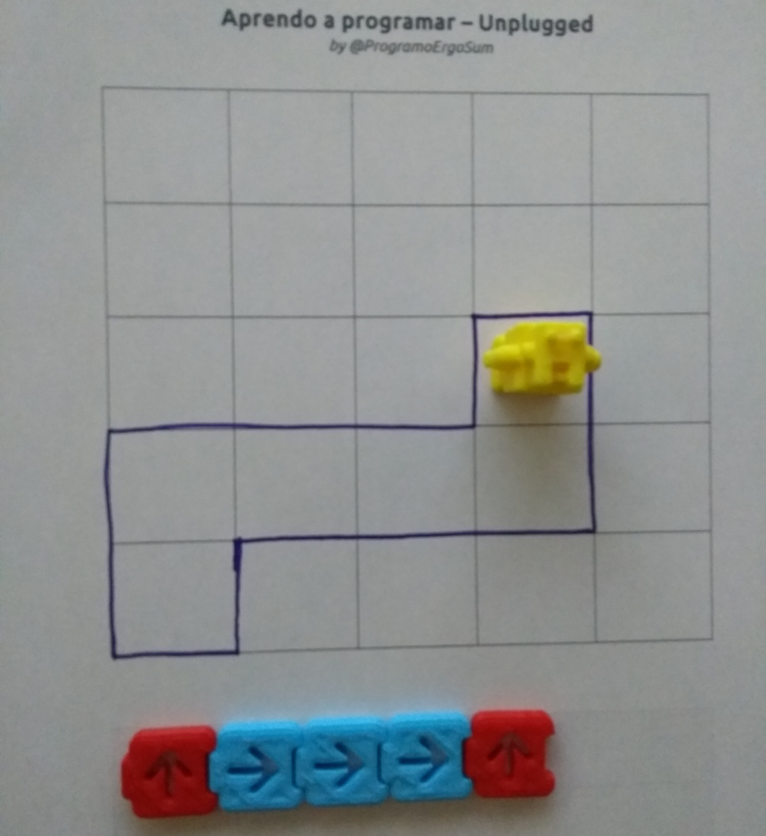

## Programación desenchufada

Actualmente podemos encontrar numerosas actividades para desarrollar el pensamiento computacional sin utilizar un ordenador, lo que se conoce como *programación desenchufada o desconectada*. Actividades que no dependen del uso de ordenadores y así poder evitar la confusión entre la informática y la programación o el aprendizaje de programas de aplicaciones informáticas.

Estas actividades de programación desconectada tienden a permitir que los alumnos descubran las respuestas por sí mismos, en lugar de darles soluciones o algoritmos que seguir, es decir, *se fomenta un enfoque constructivista* ya que queremos que los alumnos se den cuenta de que son capaces de encontrar soluciones a los problemas por su cuenta, en vez de darles una solución al problema.

  <iframe src="//www.youtube.com/embed/l7FwWt16IY4" allowfullscreen></iframe>

Las actividades desconectadas, además de ser ideales para ir adquiriendo ciertas destrezas en el mundo de la programación informática, suelen ser de bajo coste al utilizar materiales comúnmente encontrados en las aulas.

 

## CS Unplugged

El proyecto [CS Unplugged](https://csunplugged.org/es/) es una colección de material didáctico y de libre acceso que enseña las bases de la informática a través de interesantes juegos y puzles con la ayuda de cartas, cuerdas, lápices y mucha actividad física.

Cuenta con planes de estudios, planes de clases, vídeos didácticos, actividades de integración curricular y ejercicios de programación para practicar con el ordenador los conceptos de informática que acaban de aprender sin él. 

El objetivo principal del proyecto es promocionar la informática (y la computación en general) entre los jóvenes, como una disciplina interesante, fascinante e intelectualmente estimulante. 

  <iframe src="//www.youtube.com/embed/KOYy4kyLEHs" allowfullscreen></iframe>

Desde la web del proyecto podrás [descargar](https://classic.csunplugged.org/books/) un PDF disponible en varios idiomas con una gran cantidad de prácticas para realizar sin necesidad de utilizar un ordenador o dispositivo informático.

 

## Mis amigos robots

Una de las actividades más conocidas es la denominada *Mis amigos robots*, que consiste en utilizar movimientos como si de un brazo robótico se tratase para formar una escultura utilizando vasos de plástico. Para esta actividad necesitamos definir los roles de programador y robot, ya que los programadores se encargarán de realizar la secuencia de instrucciones y los robots deberán reconstruir la estructura siguiendo dichas instrucciones para obtener el mismo resultado.

Las instrucciones son muy sencillas; coger y soltar vaso, avanzar o retroceder brazo y girar 90º hacia la derecha o izquierda. En la siguiente imagen puedes ver que cada desplazamiento corresponde a una flecha.

La actividad que se suele proponer es en grupos de cuatro personas, donde una pareja actúa como programador y la otra pareja como robot. Mientras los programadores están realizando la estructura e instrucciones de programación mediante flechas, la otra pareja sale de la clase para no ver el resultado final. Una vez los programadores han realizado la estructura, los robots deberán seguir las instrucciones programadas para crear la estructura. Si los programadores han realizado bien el trabajo, y los robots han seguido las instrucciones de forma correcta, el resultado de la escultura debe ser la que programaron los robots.

 

## Cody & Roby

El juego [Cody Roby](http://codeweek.it/cody-roby-en/) proporciona una manera fácil de empezar a jugar con robots y programación sin necesidad de usar un ordenador. Roby es un robot que ejecuta instrucciones y Cody es un programador que proporciona instrucciones. Las instrucciones se representan mediante cartas. Solo hay 3 instrucciones, avanzar, girar a la derecha y girar a la izquierda.

  <iframe src="//www.youtube.com/embed/JiGjrOwOz6Y" allowfullscreen></iframe>

Las instrucciones son sencillas. Se utilizan las tres instrucciones antes mencionadas, representadas por cartas de colores, de forma que Roby se moverá por el tablero siguiéndolas. Los jugadores estarán ejecutando en realidad secuencias de instrucciones y por tanto trabajando su pensamiento computacional.

 

## El laberinto del robot

> Esta actividad es de creación nuestra y [libre](https://github.com/ProgramoErgoSum/programar-sin-ordenador) que surge como adaptación del juego utilizado por [@GorkaProfe](https://twitter.com/Gorkaprofe/status/1079352225430978562) en el aula con sus alumnos.

En este juego, cada jugador tendrá que atravesar el tablero evitando los obstáculos ocultos. Para ello deberás guiar a tu robot utilizando solamente 3 movimientos adelante, gira a la derecha y gira a la izquierda. Cada vez que te encuentres con un obstáculo será el turno de tu contrincante. El primero que logre atravesar el tablero gana la partida.

Cada jugador dispone de un tablero el cual no podrá ver su contrincante. Deberá colocar 10 obstáculos de forma aleatoria. La única condición es que tiene que haber un camino posible para que se pueda atravesar conociendo los movimientos del robot.

#### Desarrollo de la partida

Empieza el jugador 1 indicando a su contrincante en qué fila quiere colocar a su robot, por ejemplo, en la posición 1B y éste le contestará si puede colocarlo o no. En caso de poder colocarlo, continuará indicando el siguiente movimiento, por ejemplo, avanza. Y nuevamente el contrincante le indicará si puede continuar o no. Este proceso se repetirá hasta que no pueda avanzar por encontrar un obstáculo, en cuyo caso será el turno para el jugador 2.

Para facilitar la partida, se cuenta con unas fichas individuales donde podrás apuntar tus obstáculos y evitarlos en tu siguiente turno de la partida.

El primero que logre atravesar el tablero ganará la partida.

 

## Aprendo a programar

> Esta actividad es de creación nuestra y [libre](https://www.thingiverse.com/thing:3911302) que surge como adaptación del juego *Yo Aprendo a programar de Ediset*.

Con este juego se pueden aprender las bases y la lógica de la programación utilizando sencillas fichas que puedes crearte utilizando cartulina o una impresora 3D.

En este juego deberás guiar al robot hasta la meta escogiendo el mejor camino de los posibles. Para ello contarás con una serie de fichas (avanzar, retroceder, girar a la izquierda y derecha, bucles y ficha de inicio).

El juego se puede jugar en parejas, donde uno crea el recorrido sobre una hoja cuadriculada y el oponente resulve el camino utilizando los bloques de programación. 

