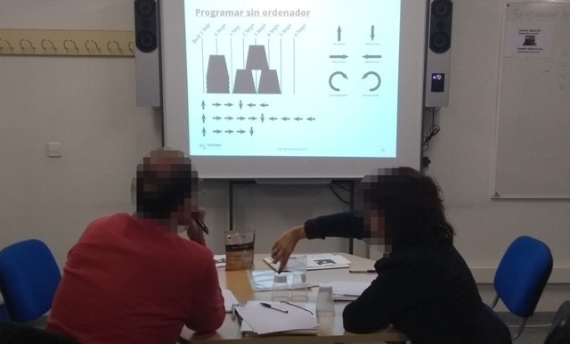
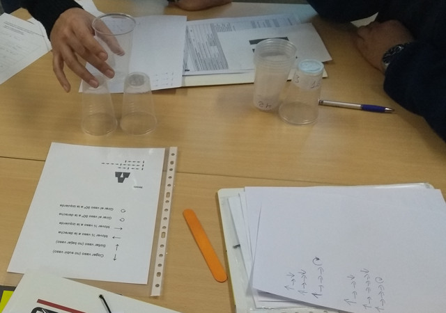
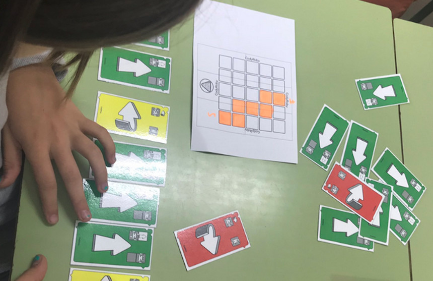
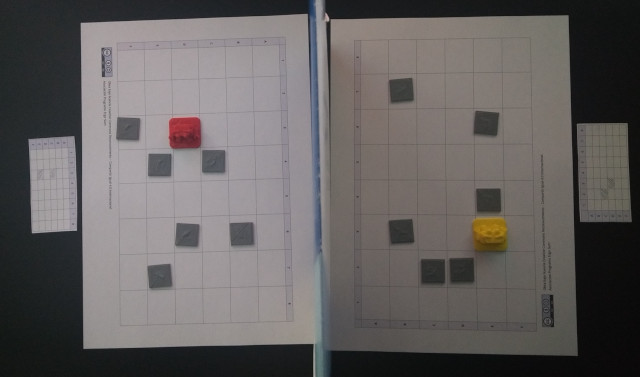

## Programación desenchufada

Actualmente podemos encontrar numerosas actividades para desarrollar el pensamiento computacional sin utilizar un ordenador. Actividades que no dependen del uso de ordenadores y así poder evitar la confusión entre la informática y la programación o el aprendizaje de programas de aplicaciones.

Estas actividades de programación desconectada tienden a permitir que los alumnos descubran las respuestas por sí mismos, en lugar de darles soluciones o algoritmos que seguir, es decir, se fomenta un enfoque constructivista ya que queremos que los alumnos se den cuenta de que son capaces de encontrar soluciones a los problemas por su cuenta, en vez de darles una solución al problema.

  <iframe src="//www.youtube.com/embed/l7FwWt16IY4" allowfullscreen></iframe>

Estas actividades son ideales para ir adquiriendo ciertas destrezas en el mundo de la programación informática, además son de bajo costo al usar material comúnmente encontrado en las aulas.

 

## CS Unplugged

<a target="_blank" href="https://csunplugged.org/es/">CS Unplugged</a> es una colección de material didáctico y de libre acceso que enseña las bases de la informática a través de interesantes juegos y puzles con la ayuda de cartas, cuerdas, lápices y mucha actividad física. Cuenta con planes de estudios, planes de clases, vídeos didácticos, actividades de integración curricular y ejercicios de programación para practicar con el ordenador los conceptos de informática que acaban de aprender sin él. 

El objetivo principal del proyecto Unplugged es promocionar la Informática (y la computación en general) entre los jóvenes como una disciplina interesante, fascinante e intelectualmente estimulante. 

  <iframe src="//www.youtube.com/embed/KOYy4kyLEHs" allowfullscreen></iframe>

> Accede a la CS Unplugged para <a target="_blank" href="https://classic.csunplugged.org/books/">descargar</a> el libro en formato PDF.

 

## Mis amigos robots

Una de las actividades más conocidas es la denominada *Mis amigos robots*, que consiste en utilizar movimientos como si de un brazo robótico se tratase para formar una escultura utilizando vasos de plástico. Para esta actividad necesitamos definir los roles de programador y robot, ya que los programadores se encargarán de realizar la secuencia de instrucciones y los robots deberán reconstruir la estructura siguiendo dichas instrucciones para obtener el mismo resultado.

Las instrucciones son muy sencillas; coger y soltar vaso, avanzar o retroceder brazo y girar 90º hacia la derecha o izquierda. En la siguiente imagen puedes ver que cada desplazamiento corresponde a una flecha.

La actividad que se suele proponer es en grupos de cuatro personas, donde una pareja actúa como programador y la otra pareja como robot. Mientras los programadores están realizando la estructura e instrucciones de programación mediante flechas, la otra pareja sale de la clase para no ver el resultado final. Una vez los programadores han realizado la estructura, los robots deberán seguir las instrucciones programadas para crear la estructura. Si los programadores han realizado bien el trabajo, y los robots han seguido las instrucciones de forma correcta, el resultado de la escultura debe ser la que programaron los robots.

 

## Cody & Roby

<a target="_blank" href="http://codeweek.it/cody-roby-en/">Cody Roby</a> es un juego que proporcionan una manera fácil de empezar a jugar con robots y programación sin necesidad de usar un ordenador y fue creado noviembre de 2014, con el fin de ser usado en la Semana Europea de la Programación.

Roby es un robot que ejecuta instrucciones y Cody es un programador que proporciona instrucciones. Las instrucciones se representan mediante cartas. 

Al principio solo hay 3 instrucciones, avanzar, girar a la derecha y girar a la izquierda. Durante el juego Cody selecciona una carta y se la pasa a Roby, quien se moverá por el tablero conforme a la instrucción que contenga la carta.

  <iframe src="//www.youtube.com/embed/JiGjrOwOz6Y" allowfullscreen></iframe>

 

## El laberinto del robot

Una actividad que surgió como implementación a una actividad realizada por Gorka, es la actividad de *El laberinto del robot*.

En este juego cada jugador tendrá que atravesar el tablero evitando los obstáculos ocultos. Para ello deberás guiar a tu robot utilizando solamente 3 movimientos adelante, gira a la derecha y gira a la izquierda. Cada vez que te encuentres con un obstáculo será el turno de tu contrincante. El primero que logre atravesar el tablero gana la partida.

