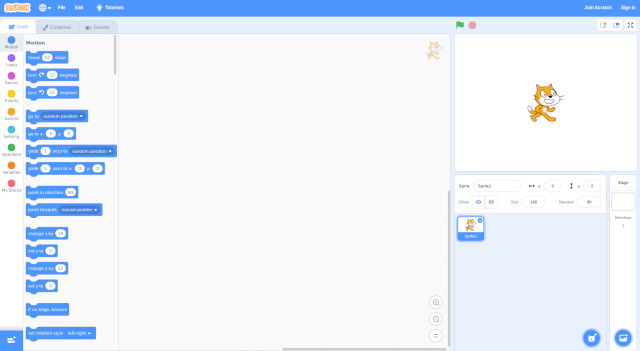
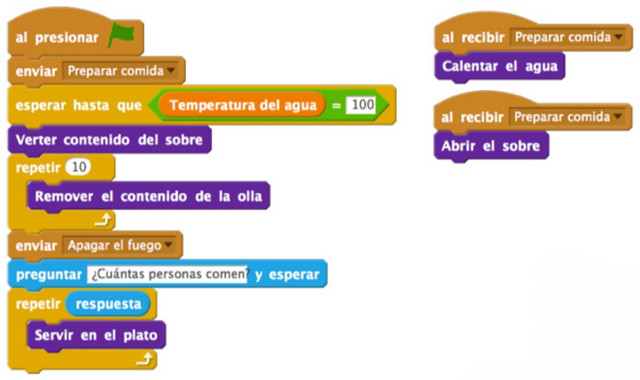

## Pensamiento Computacional

El Pensamiento Computacional se define como el proceso por el cual nos enfrentamos a un problema aplicando habilidades propias de la computación y del pensamiento crítico. Dicho de otra forma, el pensamiento computacional implica resolver problemas cotidianos haciendo uso de los conceptos fundamentales de la programación informática para resolver problemas cuyas soluciones pueden ser representadas mediante una serie de pasos o instrucciones.

> El pensamiento computacional es un proceso mental utilizado para formular problemas cuyas soluciones pueden ser llevadas a cabo por un ordenador.

### Características

Una característica importante del llamado pensamiento computacional es que se puede utilizar para la resolución de problemas cotidianas permitiendo una nueva perspectiva para llevar a cabo diferentes soluciones que no son fácilmente consideradas por otras personas​. En el proceso de dicha resolución pueden distinguirse distintas fases:

- Descomposición de u nproblema en fases más pequeñas.
- Reconocimiento de patrones repetitivos.
- Abstracción de información irrelevante al problema propuesto.
- Algoritmos presentados para la resolución del problema.

 

## ¿Qué es Scratch?

Scratch es un entorno gráfico de programación desarrollado por un grupo de investigadores del Lifelong Kindergarten Group del Laboratorio de Medios del MIT, bajo la dirección del Dr. Mitchel Resnick. Este entorno gráfico hace que la programación sea más atractiva y accesible para todo aquel que se enfrenta por primera vez a aprender un lenguaje de programación. Según sus creadores, fue diseñado como medio de expresión para ayudar a niños y jóvenes a expresar sus ideas de forma creativa, al tiempo que desarrollan habilidades de pensamiento lógico.

> Accede a nuestros <a href="https://www.programoergosum.com/cursos-online/scratch/" target="_blank">tutoriales</a> de programación con Scratch.

 

## Pensamiento computacional con Scratch

En la mayoría de los talleres que realizamos proponemos a los asistentes que realicen una receta siguiendo unos pasos o instrucciones. Esto sería un ejemplo de aplicar el pensamiento computacional. Por ejemplo, supongamos que queremos realizar un Risotto utilizando un sobre de comida preparada (para que sea más rápido). En este caso los pasos serían los siguientes:

- Abrir el sobre
- Poner a calentar el agua
- Esperar a que el agua hierva
- Si hierve, verter el sobre
- Remover el contenido de la olla
- Apagar el fuego y dejar reposar
- Servir en el plato para "x" personas

Si el anterior algoritmo lo representamos utilizando un lenguaje de programación por bloques como Scratch, el resultado podría ser el siguiente:

 

## Enlaces de interés

- <a target="_blank" href="https://classic.csunplugged.org/books/">Libro de actividades de programación sin ordenador</a>