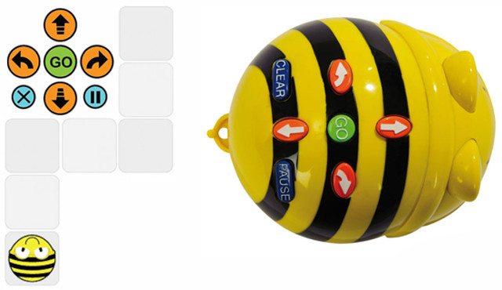
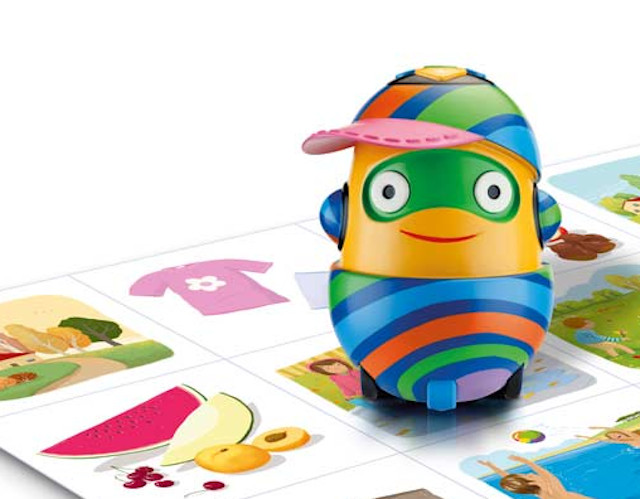
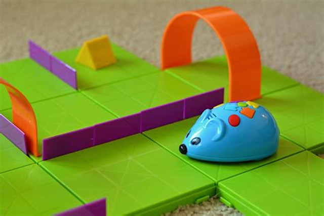
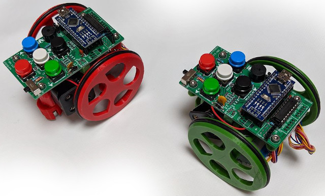

## Robots de suelo

En la actualizad contamos con diferentes robots de suelo para utilizar en el aula desde las etapas de educación infantil. Estos robots están diseñados para desarrollar las capacidades elementales de la programación y sus aplicaciones de la robótica educativa.

Entre los beneficios más importantes encontramos:

- Lateralidad: Los alumnos tienen mucho mejor adquirida la distinción entre derecha e izquierda, tanto propia como en espejo. De esta forma mejora su escritura y su posicionamiento en el entorno.
- Razonamiento lógico: Gracias al desarrollo de secuencias lógicas nuestros alumnos presentan una mejora en cuanto a razonamiento.
- Cooperativo: Podemos lograr que los niños adquieran desde etapas tempranas la aceptación de diferentes roles en una tarea y aprendan a respetar las opiniones ajenas.
- Espacial: Puesto que todo el trabajo con los robots se basa en secuencias desarrolladas en cuadriculas, el desarrollo de la percepción espacial y su relación con los espacios cercanos de nuestros alumnos se ve mejorado.

Se programan una y otra vez para conseguir una secuencia de instrucciones a través de una botonera que tiene en la parte superior de la carcasa. Se aceptan instrucciones como adelante, atrás, girar a la izquierda y girar a la derecha entre otros muchos que puedes encontrar en los diferentes robots de suelo.

En este post vamos a realizar una comparativa sobre los principales robots educativos de suelo existentes hoy en día.

 

## Beebot

La abeja Beebot es el robot de suelo más conocido y llamativo por los alumnos.

También podemos encontrar el robot Blue-Bot, similar a Bee-Bot salvo con la diferencia de que Blue-Bot incluye Bluetooth y se puede programar desde dispositivos móviles o PC a través de las apps disponibles para Android y iPad. Además es transparente lo que permite ver el interior de la abeja.

#### Características

| Nº de instruciones | Avances | Giros | Batería |
| --- | --- | --- | --- | 
| 40 | 15cm | 90º | Recargable USB |

 

## Next

Este robot creado por la empresa Edelvives también suele ser muy utilizado en las aulas.

#### Características

| Nº de instruciones | Avances | Giros | Batería |
| --- | --- | --- | --- | 
| 40 | 15cm | 90º | Recargable USB |

 

## Mouse

Este robot suele ser más económico que los anteriores aunque con diferencias enter movimientos.

#### Características

| Nº de instruciones | Avances | Giros | Batería |
| --- | --- | --- | --- | 
| 40 | 12.5cm | 90º | Utiliza 4 pilas AA |

 

## Escornabot

El robot Escornabot es un proyecto de robot educativo que nace en la Asociación Bricolabs, para iniciarse en el campo de la robótica y la programación que puede ejecutar secuencias de movimientos que son programadas por el usuario mediante la pulsación de botones del robot o introduciendo comandos en un dispositivo móvil con conexión Bluetooth. Similar a los anteriores robots de suelo, lo que hace especial a Escornabot es la filosofía que sigue de proyecto de código y hardware abierto.

#### Características

| Nº de instruciones | Avances | Giros | Batería |
| --- | --- | --- | --- | 
| Programable | Programable | Programable | Pilas / Batería |

> Como se puede observar sobre este robot de suelo es que puedes personalizarlo a tu gusto al ser de código abierto.
